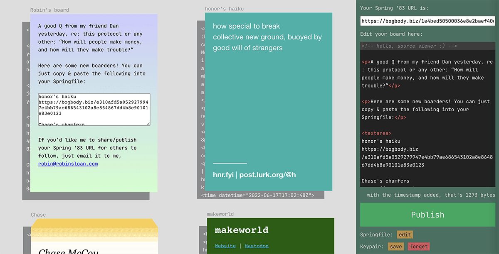

# Boarding House

This is a demo Spring '83 client that you can run as a web app on your own computer. It's intended more as a "rhetorical exhibit" than a real application; that said, I have been using it happily for several months!



## Getting started

After downloading this repository, you'll want to run

```
ruby serve.rb
```

You can substitute any directory serving scheme; that script is included as a convenience.

After the server is running, visit `http://localhost:8000/client.html`. You should see a few boards and many more RSS feed items.

However, you'll notice that the client's publishing panel is blotted out. That's because you don't yet have a conforming Spring '83 key. Visit `http://localhost:8000/generate.html`, where you can generate one.

The process really can take a long time! Have patience, and faith.

Once you've generated and saved your keypair, you can drag the file into the client and, perhaps, publish the first version of your board.

## Notes

The demo client is currently hard-coded to use my demo server at `https://bogbody.biz`. This is easily changed, if you'd like to try out your own implementation! Just edit the `Client.homeServer` function.

As you'll discover, the demo client is also a simple RSS reader. That part of the application might or might not be useful to anyone else; it happens to fit my vision of RSS perfectly, so you'll just have to suffer along with me.<br/><br/>Anyway, I like the idea of discovering new things via RSS feeds, then folding links and reactions into my board; a sort of "blogging-in-place".<br/><br/>As ever, the ghost of Google Reader hovers.

I've tried to guard against surprising data loss, but it WILL happen, eventually and inevitably. The good news is that my "Springfile" format is a breeze to back up; just email yourself a copy!

You can press `Esc` to quickly toggle the Springfile editor.

You can compose your board in Markdown! Easy!

This is a non-realtime system. The demo client insists on luxurious pauses and timeouts. Don't expect to see boards percolating while you watch.

## Status

The demo client will not be a long-term project -- I simply am not an application developer -- but/and I knew it was important to demonstrate my (very rough) vision for how Spring '83 might look and work.

Important for me, as much as for anyone else!

I will continue to tinker here, and I'll happily accept bug reports, although I might not be able to do anything about them. I am not seeking pull requests, but/and you should feel free to use this code as a starting point for your own explorations.

Thanks for investigating!